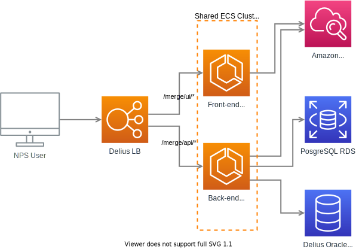

# National Delius Merge Service

The Delius Merge service provides an API, a User Interface, and Batch processes to support the merging and un-merging of offender (Service User) records within the National Delius database. 

This module defines two ECS services running on the shared Delius ECS cluster: one for the API and Batch processes and another for the User Interface.
It also defines an RDS Postgresql database used for storing merge status data, as well as configuration and internal batch processing information.

## Resources
* `api-service.tf` - ECS service, task definition, scaling policies and service registry entry for the Back-end (API + Batch)
* `ui-service.tf` - ECS service, task definition, scaling policies and service registry entry for the Front-end (UI)
* `rds.tf` - An RDS database instance

## Diagram

