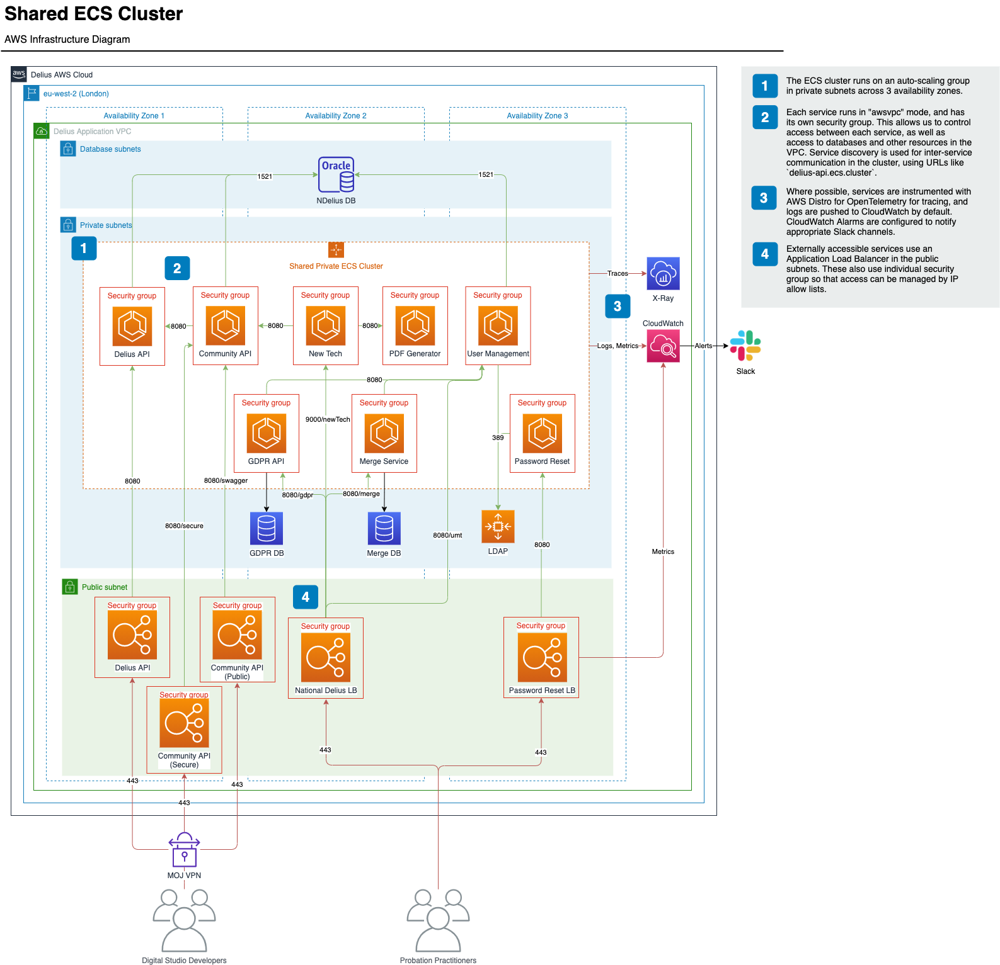

# ECS Service

Create an ECS service deployed to the Delius shared ECS cluster, with sensible defaults for IAM permissions, auto-scaling, monitoring/alerting etc.

* See [variables.tf](variables.tf) for available options.
* See [application/umt/ecs.tf](/application/umt/ecs.tf) for an example of usage.
* See the [ECS Cluster Confluence Page](https://dsdmoj.atlassian.net/wiki/spaces/DAM/pages/3107979730/ECS+Cluster) for additional information.

## Architecture Diagram
